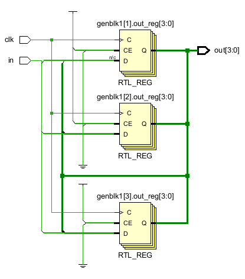
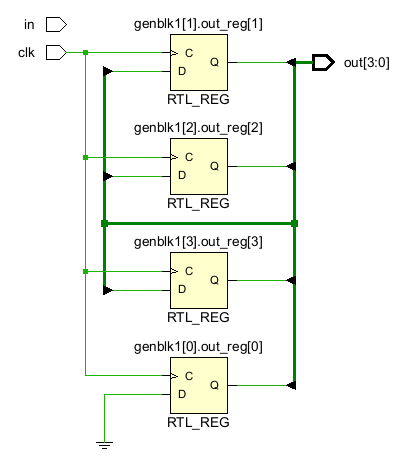
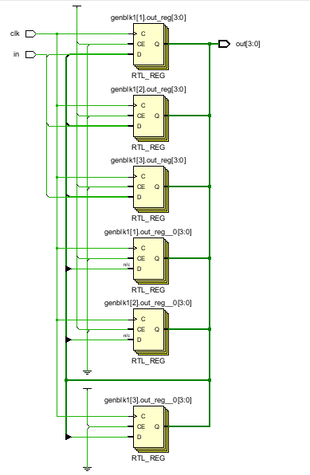
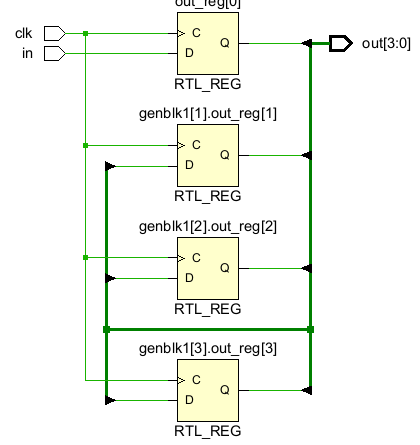
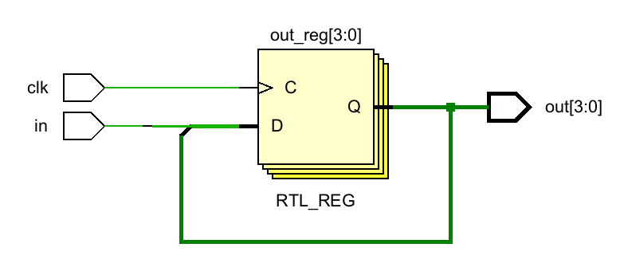
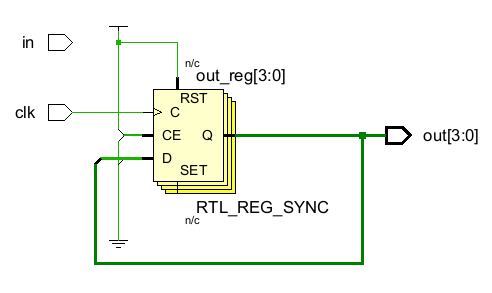

## generate for

### generate for 1

```verilog
module generate_for1(
input logic clk,
input  logic in,
output logic [3:0]out
    );

genvar i;   

generate 
for(i=1;i<=3;i=i+1) begin
always_ff@(posedge clk) begin
out[0]<=in;

out[i]<=out[i-1];
end
end
endgenerate
endmodule
```



### generate for2

```verilog
module generate_for1(
input logic clk,
input  logic in,
output logic [3:0]out
    );

genvar i;   

generate 
for(i=0;i<=3;i=i+1) begin
always_ff@(posedge clk) begin
//out[0]<=in;

out[i]<=out[i-1];
end
end
endgenerate
endmodule
```



> 草率了，忘记数组不能负索引了，但是负索引竟然可以综合

### generate for3

```verilog
module generate_for1(
input logic clk,
input  logic in,
output logic [3:0]out
    );

genvar i;   

generate 
for(i=1;i<=3;i=i+1) begin
always_ff@(posedge clk) begin
//out[0]<=in;
out[i]<=out[i-1];
end
always_ff@(posedge clk) begin
out[0]<=in;
end


end
endgenerate
endmodule
```



### generate for 4

```verilog
module generate_for1(
input logic clk,
input  logic in,
output logic [3:0]out
    );

genvar i;   

generate 
for(i=1;i<=3;i=i+1) begin
always_ff@(posedge clk) begin
//out[0]<=in;
out[i]<=out[i-1];
end
end
endgenerate
always_ff@(posedge clk) begin
out[0]<=in;
end
endmodule
```



## for

### for1

```verilog
module for1(
input logic clk,
input  logic in,
output logic [3:0]out
    );

integer i;   
always_ff@(posedge clk) begin
out[0]<=in;
for(i=1;i<=3;i=i+1) begin 
out[i]<=out[i-1];
end

end 
endmodule
```



### for2

```verilog
module for1(
input logic clk,
input  logic in,
output logic [3:0]out
    );

integer i;   
always_ff@(posedge clk) begin
out[0]<=in;
for(i=0;i<=3;i=i+1) begin 
out[i]<=out[i-1];
end

end 
endmodule
```



> 草率了，忘记数组不能负索引了，但是负索引竟然可以综合
